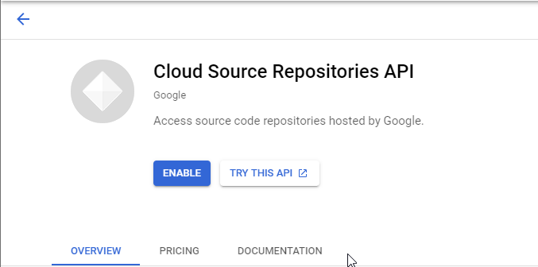

# Overview

## Terraform

想用Docker執行Terraform，到hashicorp放在Docker Hub的頁面[hashicorp/terraform](https://www.mrjamiebowman.com/software-development/docker/running-terraform-in-docker-locally/)可以看到它的簡易用法為

```sh
docker run -i -t hashicorp/terraform:light plan main.tf
```

但就算是將目錄切換到有main.tf的那一層，實際上在執行時也會出現問題

```sh
stat main.tf: no such file or directory
```

在Git Issue那[The Terraform example at DockerHub is outdated](https://github.com/hashicorp/docker-hub-images/issues/58)似乎也有人有相同旳問題，但看了一下時間，是2018年的，也就是二年過去了那個使用簡例依然是不正確的。只好再找看看有沒有什麼地方有討論。[Terraform as Docker returns error on plan](https://stackoverflow.com/questions/60366661/terraform-as-docker-returns-error-on-plan)，這篇裡似乎就有針對此問題進行解說。簡單來看，就是要將main.tf檔mount進去。

```sh
docker run -it -v $PWD/:/tr-scripts  hashicorp/terraform:light plan /tr-scripts/
```

```Dockerfile
From hashicorp/terraform:light
COPY ./TR-SCRIPT /tr-scripts

RUN terraform init /tr-scripts
```

直接試試看

```sh
Error: No configuration files

Plan requires configuration to be present. Planning without a configuration
would mark everything for destruction, which is normally not what is desired.
If you would like to destroy everything, run plan with the -destroy option.
Otherwise, create a Terraform configuration file (.tf file) and try again.
```

看起來是另一個錯誤了，至少讀到了一個沒有寫好的main.tf檔，但仍是不正確的。再找的另一篇[Utilize hashicorp/terraform image as CLI](https://discuss.hashicorp.com/t/utilize-hashicorp-terraform-image-as-cli/4794)，雖然是用docker compose一樣碰到問題。此篇討論裡連到的另一篇文章[Terraforming with a whale (docker)](https://blog.elreydetoda.site/docker-terraform/#generalcommands)或許有解決的方案。


```sh
# first do an init to pull down plugins
docker run -it --rm -v "$(pwd)/.terrform":/.terraform/ -v "$(pwd)"/terraform:/terraform hashicorp/terraform:light init /terraform/

# then do a plan out to a file
docker run -it --rm -v "$(pwd)/.terrform":/.terraform/ -v "$(pwd)"/terraform:/terraform hashicorp/terraform:light plan -out /terraform/main.plan /terraform/

# apply the plan
docker run -it --rm -v "$(pwd)/.terrform":/.terraform/ -v "$(pwd)"/terraform:/terraform hashicorp/terraform:light apply -state /terraform/main.tfstate /terraform/main.plan

# lastly destroy everything
docker run -it --rm -v "$(pwd)/.terrform":/.terraform/ -v "$(pwd)"/terraform:/terraform hashicorp/terraform:light destroy -auto-approve -state /terraform/main.tfstate /terraform/
```

也可參考可其它的文章

- [Getting started with Terraform on Google Cloud](https://cloud.google.com/community/tutorials/getting-started-on-gcp-with-terraform)
- [Terraform With Docker](https://www.vic-l.com/terraform-with-docker/)
- [Yes, Terraform can do that: Docker](https://www.phillipsj.net/posts/yes-terraform-can-do-that-docker/)
- [Running Terraform in Docker Locally](https://www.mrjamiebowman.com/software-development/docker/running-terraform-in-docker-locally/)
- [Treating Your Terraform like an Application: Part 1](https://medium.com/capital-one-tech/treating-your-terraform-like-an-application-why-terraform-in-a-docker-container-31e802314b4)
- [Treating Your Terraform like an Application: Part 2](https://medium.com/capital-one-tech/treating-your-terraform-like-an-application-how-to-dockerize-terraform-5d7edac741fc)
- [初試 Terraform - 基本介紹與用程式碼部署 Lambda (上)](https://yuanchieh.page/posts/2019-10-31_try-terraform/)
- [入門學習筆記](https://godleon.github.io/blog/DevOps/terraform-getting-started/)
- [Terraform 自動化的基礎架構介紹](https://medium.com/@chihsuan/terraform-%E8%87%AA%E5%8B%95%E5%8C%96%E7%9A%84%E5%9F%BA%E7%A4%8E%E6%9E%B6%E6%A7%8B%E4%BB%8B%E7%B4%B9-f827e8975e98)

相關書籍

- [Terraform: Up & Running: Writing Infrastructure as Code](https://www.amazon.com/-/zh_TW/Terraform-Running-Writing-Infrastructure-Code-ebook-dp-B07XKF258P/dp/B07XKF258P/ref=mt_other?_encoding=UTF8&me=&qid=)

其中的Treating Your二篇系列沒有直接用hashicorp維護好的Docker，而是自行用安裝好golang環境的docker下載後引用。

若是不想要將json檔額外傳入，則要將其放置在和此tf plan同層的位置。而這個json檔是利用service account而創出的。但比較好的使用方式應該是額外傳入，這點要在研究是否是用Terraform Variable來進行。

```tf
terraform {
  required_providers {
    google = {
      source = "hashicorp/google"
    }
  }
}

provider "google" {
  version = "3.5.0"

  credentials = file("/terraform/xxxx.json")

  project = "xxxx"
  region  = "us-west1"
  # zone    = "us-central1-c"
}
```

如果Google Cloud Build沒有Enable API就會看到如下的錯誤

```sh
Error: Error creating Trigger: googleapi: Error 403: Cloud Build API has not been used in project 370463943785 before or it is disabled. Enable it by visiting https://console.developers.google.com/apis/api/cloudbuild.googleapis.com/overview?project=370463943785 then retry. If you enabled this API recently, wait a few minutes for the action to propagate to our systems and retry.
```

相較於Google Cloud Build的提示，Google Source Repositories就隱晦的多了，一定要從link過去才能開啓。但這個畫面顥示的Repo似乎是是古早以前的版本，不確定是否會產生新的。

```sh
Error: Error creating Repository: googleapi: Error 403: Cloud Source Repositories API has not been used in project 370463943785 before or it is disabled. Enable it by visiting https://console.developers.google.com/apis/api/sourcerepo.googleapis.com/overview?project=370463943785 then retry. If you enabled this API recently, wait a few minutes for the action to propagate to our systems and retry.
```



簡單的試驗，產生了一個Google Source Repo後移掉，再用Terraform產生

```sh
Error: Error creating Repository: googleapi: Error 403: The caller does not have permission
```

看起來手動產生時已經直接Enable API了。


至於Google Storage，並不需要事先開啓API，即可佈署。但要記得設置相關的權限給服務帳戶。

詳細的用法可以參考Terraform文件

- [google_sourcerepo_repository](https://www.terraform.io/docs/providers/google/r/sourcerepo_repository.html)
- [google_cloudbuild_trigger](https://www.terraform.io/docs/providers/google/r/cloudbuild_trigger.html)
- [google_storage_bucket](https://www.terraform.io/docs/providers/google/r/storage_bucket.html)

有些可設定的參數無法藉由設定檔進行，像是Google Storage的Location Type，目前沒有看到如何設定，預設是Region，這之後再花些時間了解。

## Unity Cloud Build

現在沒有UCB的Terraform provider，所以沒有辦法一次管理，而且UCB的API裡產生的部份很少，多數都是查詢用。所以最好的方法是用Docker滙整指令，之後再做調整。

```sh
time DOCKER_BUILDKIT=1 docker image build -t walkio-dev-pre-setup:latest --no-cache --build-arg PROJECT_ID="walkio-271711" --build-arg ORG_ID="apprenticegc" --build-arg UCB_API_KEY="$(cat ./secret-info/secrets/unity-cloud-build.txt)" --build-arg GCS_BUCKET="joybrick-walkio-dev" -f ./push-to-build-repo/Dockerfile-release .

docker container run -it walkio-dev-pre-setup /bin/sh
```

### Get API key

可以從Unity Cloud Build Settings & Preferences這裡拿到，基本上這是Organization的資料，所以每個在其下的專案都是用一樣的API Key。
